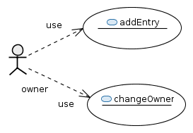

# checksumDatabase

A simple bockchain base database for version checksums.




see [doc](checksumDatabase/doc/contract.md) for details


You can manage and deploy the contract with the given script. The checksum script is a simple wrapper script around the java command line program. 

```
usage: checksum -a <contractAddress version checksum> | -ad <contractAddress directory> | -af <contractAddress filename> | -c <name url description> |
       -co <contractAddress newOwner> | -h | -l <contractAddress> | -v <contractAddress filename> | -vd <contractAddress directory>   [-algorithm
       <algoname>]   [-f <file alreadyCompiled>] [-fileFilter <wildcard>]   [-millis <millisec>] [-noList] [-sk <keyFile>] [-sp <password>]   [-wca
       <filename>]

A deployer and manager for for a version database on the blockchain. (c) Urs Zeidler 2017

 -a,--addVersion <contractAddress version checksum>   Add a new version in the database.
 -ad,--addDir <contractAddress directory>             Add entries from a directory.
 -af,--addFile <contractAddress filename>             Add a file to the entries.
 -algorithm <algoname>                                Set the algorithm for the checksum. MD5 is the default.
 -c,--create <name url description>                   Creates a new checksum database by deploying the contract.
 -co,--changeOwner <contractAddress newOwner>         Change the owner of the contract.
 -f,--file <file alreadyCompiled>                     Set the contract source or the compiled json.
 -fileFilter <wildcard>                               The file filter used for the directory action. *.* is the default.
 -h                                                   show help and usage
 -l,--list <contractAddress>                          List the versions and the contract data.
 -millis <millisec>                                   The millisec to wait between checking the action.
 -noList                                              Don't list the entries of the database.
 -sk,--senderKey <keyFile>                            Set the sender key file.
 -sp,--senderPass <password>                          Set the pass of the key of the sender.
 -v,--verify <contractAddress filename>               Verify a file against the checksum database.
 -vd,--verifyDirectory <contractAddress directory>    Verify all matching files of a directory against the checksum database.
 -wca,--writeContractAddress <filename>               Write contract to file.

example: checksum -c  aName http://example.io 'A description for the database'
create a new Database with aName as name

Available hash algorithms:
2.16.840.1.101.3.4.2.10 2.16.840.1.101.3.4.2.7 2.16.840.1.101.3.4.2.8 2.16.840.1.101.3.4.2.9 BLAKE2B-160 BLAKE2B-256 BLAKE2B-384 BLAKE2B-512 GOST3411
GOST3411-2012-256 GOST3411-2012-512 KECCAK-224 KECCAK-256 KECCAK-288 KECCAK-384 KECCAK-512 MD2 MD4 MD5 OID.2.16.840.1.101.3.4.2.10
OID.2.16.840.1.101.3.4.2.7 OID.2.16.840.1.101.3.4.2.8 OID.2.16.840.1.101.3.4.2.9 RIPEMD128 RIPEMD160 RIPEMD256 RIPEMD320 SHA SHA-1 SHA-224 SHA-256
SHA-384 SHA-512 SHA-512/224 SHA-512/256 SHA3-224 SHA3-256 SHA3-384 SHA3-512 SKEIN-1024-1024 SKEIN-1024-384 SKEIN-1024-512 SKEIN-256-128 SKEIN-256-160
SKEIN-256-224 SKEIN-256-256 SKEIN-512-128 SKEIN-512-160 SKEIN-512-224 SKEIN-512-256 SKEIN-512-384 SKEIN-512-512 SM3 TIGER WHIRLPOOL

Returns 0 if all went well.
Returns 1000 if the file can not be verified.
Returns 10 in all of the exception cases.
```

The script will be configured by the 'checksum.conf' file.

```
## config for the checksum smart contact

#### instance can be one of:
## main -the main network
## test
## ropsten
## private
## InfuraRopsten
## InfuraMain
## rpc


INSTANCE=rpc
## for rcp only
RPC_URL=http://localhost:8545
NET=03
## for infura only
INFRA_API_KEY=

## the jar
JAR=checksumDatabase-0.0.1-SNAPSHOT.jar

##key and pass
KEYFILE=
PASS=

## where to find java
JAVA=java
```

In the conf you define how the program will access the ethereum blockchain with the INSTANCE parameter and define the key and the secret to that key.
The possible INSTANCES are:

    main - the main net
    ropsten - the new testnet
    test - for the old testnet
    private - for a private net
    rcp - to connect to a running rcp instance
        url - this additional property defines the url of this instance
        network id (0 for mainnet and 3 for the rposten testnet)
    InfuraMain - rcp via Infura for the main net
    InfuraRopsten - rcp via Infura for the ropsten testnet
        apiKey - the api key
    custom - a freely configurable chain

